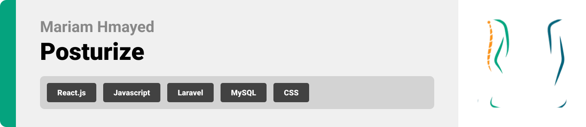
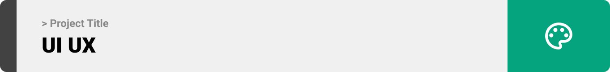
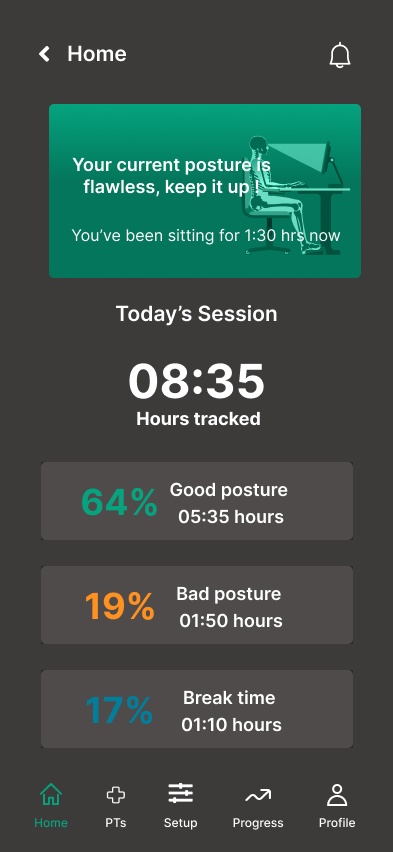
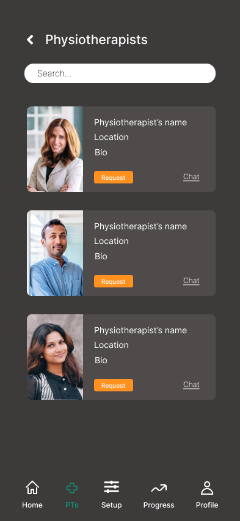
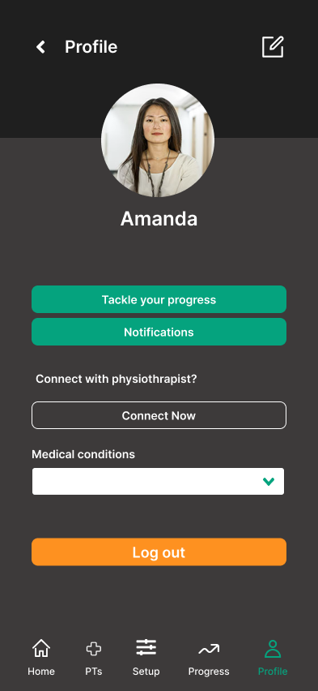

<br><br>

<!-- project philosophy -->


> Posturize targets employees sitting on the chair for a long period of time and suffering from spine pain caused by poor sitting posture and helps them maintain a good one by monitoring it, providing a user-friendly platform that notifies user when a poor sitting posture is detected.

### User Stories
Employee Stories
- As an employee, I want to receive notifications on my mobile device when my sitting posture is incorrect, so that I can adjust my posture and prevent spine pain caused by prolonged sitting.
- As an employee, I want the system to provide guidance on how to correct my sitting posture when it detects that it's incorrect, so that I can improve my posture over time.
- As an employee with a history of spine pain due to poor sitting posture, I want the system to track my sitting habits over time and provide insights and recommendations for improving my posture, so that I can prevent future health problems.

Physiotherapist Stories 
- As a physiotherapist, I want to access data about my patients' sitting habits and posture over time, so that I can provide personalized recommendations for improving their posture and reducing back pain.
- As a physiotherapist, I want to receive real-time notifications when my patients exhibit poor sitting posture, so that I can intervene promptly and provide immediate feedback or guidance to help them correct their position.
- As a physiotherapist, I want to track the effectiveness of posture correction interventions prescribed to my patients, so that I can make informed adjustments to their treatment plans and optimize their rehabilitation outcomes.
<br><br>
<!-- Tech stack -->


###  Posturize is built using the following technologies:

- This project uses the [React Native app development framework](https://reactnative.dev/) with [Expo](https://expo.dev/). React Native is a cross-platform hybrid app development platform which allows us to use a single codebase for apps on mobile, desktop, and the web.
- The backend of the app is built using the [Laravelframework](https://laravel.com/). Laravel is a popular PHP framework known for its elegant syntax, extensive feature set, and developer-friendly tools, making it ideal for building robust backends for mobile applications.
- To send local push notifications, the app uses the [Expo Notifications](https://docs.expo.dev/versions/latest/sdk/notifications/) package which supports Android, iOS, and macOS.
- For the live chat feature, the app uses [Firebase](https://firebase.google.com/) and [Firestore](https://firebase.google.com/docs/firestore), which provide real-time data synchronization and reliable cloud storage.

<br><br>
<!-- UI UX -->



> We designed Posturize using wireframes and mockups, iterating on the design until we reached the ideal layout for easy navigation and a seamless user experience.

- Project Figma design [figma](https://www.figma.com/design/1KkHNvv5MPKDxcgSjpcrfX/Posturize?node-id=625-1031&t=8l71yW8tLkKQNfq3-0)


### Mockups
| Home screen  | Physiotherapists Screen | Profile Screen |
| ---| ---| ---|
|  |  |  |

<br><br>

<!-- Database Design -->


###  Architecting Data Excellence: Innovative Database Design Strategies:

- [database diagram]


<br><br>


<!-- Implementation -->


### User Screens (Mobile)
| Login screen  | Register screen | Landing screen | Loading screen |
| ---| ---| ---| ---|
|  |  |  |  |
| Home screen  | Menu Screen | Order Screen | Checkout Screen |
|  |  |  |  |

### Admin Screens (Web)
| Login screen  | Register screen |  Landing screen |
| ---| ---| ---|
|  |  |  |
| Home screen  | Menu Screen | Order Screen |
|  |  |  |

<br><br>


<!-- Prompt Engineering -->


###  Mastering AI Interaction: Unveiling the Power of Prompt Engineering:

- This project uses advanced prompt engineering techniques to optimize the interaction with natural language processing models. By skillfully crafting input instructions, we tailor the behavior of the models to achieve precise and efficient language understanding and generation for various tasks and preferences.

<br><br>

<!-- AWS Deployment -->


###  Efficient AI Deployment: Unleashing the Potential with AWS Integration:

- This project leverages AWS deployment strategies to seamlessly integrate and deploy natural language processing models. With a focus on scalability, reliability, and performance, we ensure that AI applications powered by these models deliver robust and responsive solutions for diverse use cases.

<br><br>

<!-- Unit Testing -->


###  Precision in Development: Harnessing the Power of Unit Testing:

- This project employs rigorous unit testing methodologies to ensure the reliability and accuracy of code components. By systematically evaluating individual units of the software, we guarantee a robust foundation, identifying and addressing potential issues early in the development process.

<br><br>


<!-- How to run -->


> To set up Coffee Express locally, follow these steps:

### Prerequisites

This is an example of how to list things you need to use the software and how to install them.
* npm
  ```sh
  npm install npm@latest -g
  ```

### Installation

_Below is an example of how you can instruct your audience on installing and setting up your app. This template doesn't rely on any external dependencies or services._

1. Get a free API Key at [example](https://example.com)
2. Clone the repo
   git clone [github](https://github.com/your_username_/Project-Name.git)
3. Install NPM packages
   ```sh
   npm install
   ```
4. Enter your API in `config.js`
   ```js
   const API_KEY = 'ENTER YOUR API';
   ```

Now, you should be able to run Coffee Express locally and explore its features.