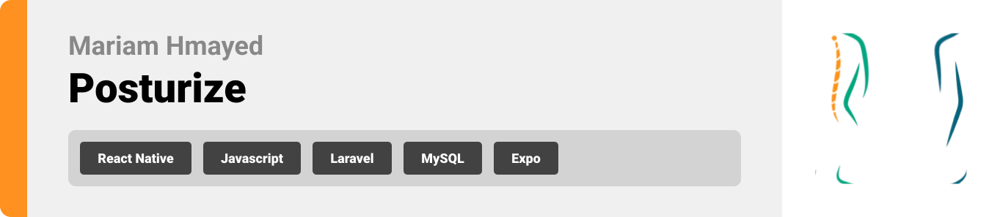
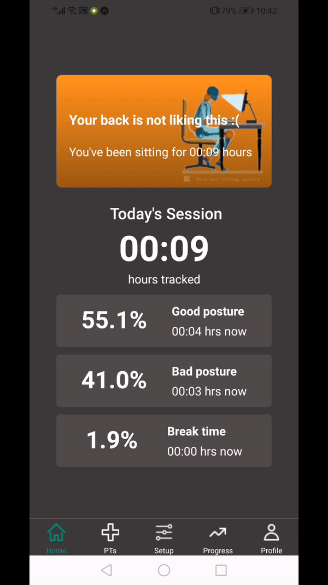

<br><br>

<!-- project philosophy -->


> Posturize targets employees sitting on the chair for a long period of time and suffering from spine pain caused by poor sitting posture and helps them maintain a good one by monitoring it, providing a user-friendly platform that notifies user when a poor sitting posture is detected.

### User Stories
Employee Stories
- As an employee, I want to receive notifications on my mobile device when my sitting posture is incorrect, so that I can adjust my posture and prevent spine pain caused by prolonged sitting.
- As an employee, I want the system to provide guidance on how to correct my sitting posture when it detects that it's incorrect, so that I can improve my posture over time.
- As an employee with a history of spine pain due to poor sitting posture, I want the system to track my sitting habits over time and provide insights and recommendations for improving my posture, so that I can prevent future health problems.

Physiotherapist Stories 
- As a physiotherapist, I want to access data about my patients' sitting habits and posture over time, so that I can provide personalized recommendations for improving their posture and reducing back pain.
- As a physiotherapist, I want to receive real-time notifications when my patients exhibit poor sitting posture, so that I can intervene promptly and provide immediate feedback or guidance to help them correct their position.
- As a physiotherapist, I want to track the effectiveness of posture correction interventions prescribed to my patients, so that I can make informed adjustments to their treatment plans and optimize their rehabilitation outcomes.
<br><br>
<!-- Tech stack -->


###  Posturize is built using the following technologies:

- This project uses the [React Native app development framework](https://reactnative.dev/) with [Expo](https://expo.dev/). React Native is a cross-platform hybrid app development platform which allows us to use a single codebase for apps on mobile, desktop, and the web.
- The backend of the app is built using the [Laravel framework](https://laravel.com/). Laravel is a popular PHP framework known for its elegant syntax, extensive feature set, and developer-friendly tools, making it ideal for building robust backends for mobile applications.
- To send local push notifications, the app uses the [Expo Notifications](https://docs.expo.dev/versions/latest/sdk/notifications/) package which supports Android, iOS, and macOS.
- For the live chat feature, the app uses [Firebase](https://firebase.google.com/) and [Firestore](https://firebase.google.com/docs/firestore), which provide real-time data synchronization and reliable cloud storage.

<br><br>
<!-- UI UX -->


> We designed Posturize using wireframes and mockups, iterating on the design until we reached the ideal layout for easy navigation and a seamless user experience.

- Project Figma design [figma](https://www.figma.com/design/1KkHNvv5MPKDxcgSjpcrfX/Posturize?node-id=625-1031&t=8l71yW8tLkKQNfq3-0)


### Mockups
| Home screen  | Physiotherapists Screen | Profile Screen |
| ---| ---| ---|
|   |   |   |

<br><br>

<!-- Database Design -->


###  Architecting Data Excellence: Innovative Database Design Strategies:


<br><br>


<!-- Implementation -->


### User Screens (Mobile)
| Login screen | Register screen | Setup Screen |
|--------------|-----------------|--------------|
|  |  |  |

| Home Screen | Physiotherapists Screen | Progress screen |
|-------------------------|-----------------|-------------|
|  |   |  |

| Patients screen | RecentChat screen | Profile Screen |
|-----------------|-------------------|----------------|
|  |  |  |


### Arduino
| Demo | Real Image |
| ---| ---|
|   |  |
| Sensors Dashboard                                                                                    |
|                                 |

<br><br>
 
<!-- AWS Deployment -->


###  Optimized Deployment: Maximizing Potential with AWS Integration:

- This project utilizes AWS deployment strategies to seamlessly integrate and deploy advanced solutions. By focusing on scalability, reliability, and performance, we ensure that our applications provide robust and responsive solutions across various use cases.
To deploy Posturize Laravel backend to AWS, after [connecting to the AWS EC2 instance through PuTTY](https://docs.aws.amazon.com/AWSEC2/latest/UserGuide/putty.html). 

- **Step 1**: Update Packages
  ```sh
  sudo apt update
  sudo apt upgrade -y
  ```
- **Step 2**: Install Composer, Apache and PHP
  ```sh
  sudo apt install composer -y
  sudo apt-get install apache2
  sudo apt-get install php-mysql
  ```
- **Step 3**: Create Virtual Hosts File
  ```sh
  sudo nano /etc/apache2/sites-available/laravel.conf
  ```
- **Step 4**: Copy and paste the following snippet into `laravel.conf`:

  ```
  <VirtualHost *:80>
      ServerName <YOUR_IPv4_ADDRESS_HERE>
      DocumentRoot /var/www/html/posturize/backend/public

      <Directory /var/www/html/posturize/backend/public>
         AllowOverride All
         Require all granted
     </Directory>
     ProxyRequests Off
     ProxyPass / http://127.0.0.1:8000/
     ProxyPassReverse / http://127.0.0.1:8000/

     <Proxy *>
         Order allow,deny
         Allow from all
     </Proxy>

     ErrorLog ${APACHE_LOG_DIR}/error.log
     CustomLog ${APACHE_LOG_DIR}/access.log combined
  </VirtualHost>
  ```

  Replace `YOUR_IPv4_ADDRESS_HERE` with your AWS EC2 instance's IPv4 Public Address.

- **Step 5**: Activate your virtual host setup, then reload Apache:
  ```sh
  sudo a2ensite laravel
  sudo systemctl reload apache2
  ```
- **Step 6**: Clone this repository, then set permissions
  ```sh
  cd /var/www/html
  sudo git clone https://github.com/MaryamHmayed/Posturize /var/www/html/posturize
  sudo chown -R ubuntu:ubuntu /var/www/html/posturize
  ```
  Replace `ubuntu:ubuntu` with your instance username.
- **Step 7**: Install MySQL on your instance. A good guide can be found here: [How To Install MySQL on Ubuntu 20.04 (DigitalOcean)](https://www.digitalocean.com/community/tutorials/how-to-install-mysql-on-ubuntu-20-04)

- **Step 8**: Once MySQL is installed, follow the steps in the "How To Run?" section below (Backend Setup).


<br><br>

<!-- Unit Testing -->


###  Ensuring Accuracy in Development: The Role of Unit Testing:

- This project employs thorough unit testing methodologies to ensure the reliability and accuracy of code components. By systematically assessing individual units of the software, we establish a solid foundation and address potential issues early in the development process.


<br><br>


<!-- How to run -->


> To set up Posturize locally, follow these steps:

### Prerequisites

1. Install [Node & NPM](https://nodejs.org/en/download).

2. Install [Composer](https://getcomposer.org/download/)

3. Database server: Any Apache HTTP Server, MariaDB database server, recommended [XAMPP](https://www.apachefriends.org/download.html).

4. Install [Arduino IDE](https://www.arduino.cc/en/software)  and create an account on [Adafruit website](https://io.adafruit.com/)

5. For hardware: ESP8266, 3 Strain Gauge Bending sensors, and a Multiplexer.

### Installation

### Frontend (React Native)

```sh
git clone https://github.com/MaryamHmayed/Posturize
```

1. Navigate to the frontend directory

```sh
cd frontend
```

2. Install NPM packages

```sh
 npm install npm@latest -g
```

3. Start the project

```sh
  npm start
```
4. After running the command above, you will see a QR code in your terminal. Scan this QR code to open the app on your device (if you're using an Android Emulator or iOS Simulator, you can press a or i respectively to open the ).

### Backend (Laravel)

1. Navigate to the backend directory

```sh
cd backend
```

2. Install Composer dependencies

```sh
composer install
```

3. Install Composer dependencies

```sh
composer install
```

4. Generate the application key

```sh
php artisan key:generate
```

5. Download Laravel dependencies

```sh
php artisan migrate
```
6. Run the server on computer's local IP address

```sh
php artisan serve --host local_IP_address
```

### Hardware

1. Connect the arduino to the sensors.

2. Connect the arduino to the computer.

3. Upload the code in arduino/sensorData file.

4. Start a new feed in your Adafruit account and get the AIO_KEY.

5. Add your Wifi credentials to the code.

6. Add your AIO credentials 

```sh
#define AIO_USERNAME    "strain_project" //cloud username
#define AIO_KEY         "" //auth key
#define FEED_NAME       "data"

```
Now, you should be able to run Posturize locally and explore its features.